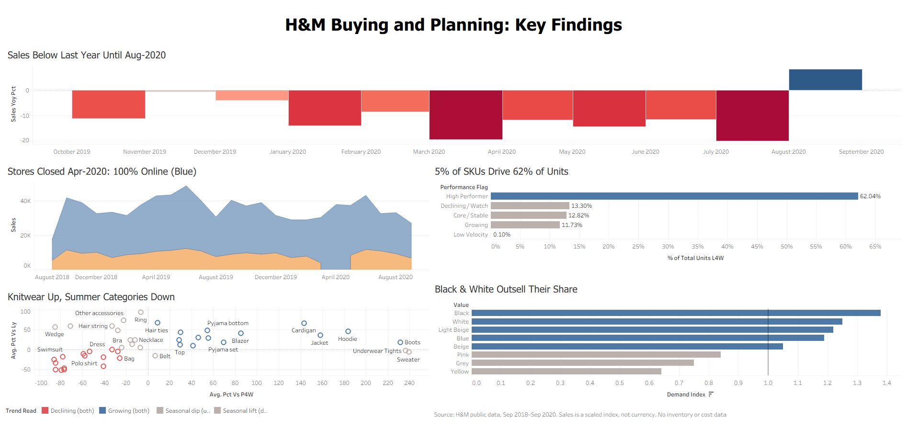

# Fashion Buying & Planning Analytics

**SQL · Tableau · H&M transaction data (31.8M rows)**

An analysis of H&M's public transaction and product data, written from the point of view of an analyst supporting a fashion **Buying & Planning** team. The goal is to turn raw sales lines into answers the team uses every week: *what is selling, what isn't, which categories are trending up or down, and where to look more closely.*

> 📊 **Interactive dashboard:** [H&M Buying & Planning: Key Findings (Tableau Public)](https://public.tableau.com/app/profile/aaron.casarez/viz/HMBuyingandPlanningKeyFindings/Dashboard1)
>
> 

---

## Business problem

A Buying & Planning team needs a regular view of demand to:
- track overall performance (sales, transactions, active SKUs, average selling price)
- see which departments, garment groups and product types are winning or losing
- find the individual SKUs driving demand and the ones that aren't moving
- separate real momentum from seasonality
- get a short list of items to protect, chase, review or exit

## Dataset

| | |
|---|---|
| Source | [H&M Personalized Fashion Recommendations (Kaggle)](https://www.kaggle.com/competitions/h-and-m-personalized-fashion-recommendations/data) |
| Period | 2018-09-20 to 2020-09-22 (105 weeks) |
| Volume | 31.8M transaction lines · 105.5K articles · 1.37M customers |
| Grain | One row = one unit sold (date, customer, article, price, channel) |

Setup instructions are in [`data/README.md`](data/README.md).

## Tools

- **DuckDB (SQL)** for loading, data-quality checks and all analysis. It handles 31.8M rows locally in seconds.
- **Tableau** for the dashboard, built from aggregated exports.
- SQL techniques used: CTEs, joins, `CASE`, window functions (`LAG`, `RANK`, `PERCENT_RANK`, `NTILE`, running totals), and period-over-period comparisons.

## Questions analyzed

| # | Question | SQL |
|---|---|---|
| 1 | How are sales, transactions, active SKUs and ASP trending by week and month? | [`02_business_performance.sql`](sql/02_business_performance.sql) |
| 2 | Which departments, garment groups, sections and product types perform best and worst? | [`03_category_performance.sql`](sql/03_category_performance.sql) |
| 3 | Which SKUs drive demand, and which have low sales velocity? | [`04_product_performance.sql`](sql/04_product_performance.sql) |
| 4 | What is growing or declining (L4W vs P4W, and vs last year)? | [`05_trend_analysis.sql`](sql/05_trend_analysis.sql) |
| 5 | Which attributes (colour, pattern, product group) show stronger demand? Which SKUs need attention? | [`06_assortment_opportunities.sql`](sql/06_assortment_opportunities.sql) |

## Data-quality checks

Before the analysis, I ran audits in [`01_data_quality_checks.sql`](sql/01_data_quality_checks.sql).

| Check | Result | Handling |
|---|---|---|
| Duplicate primary keys (articles, customers) | None | - |
| Identical transaction rows | 2.54M groups, 9.4% extra rows; mostly 2–3 per group | **Kept.** There's no quantity column, so repeats are multi-unit purchases (a basket with 2 of the same item) |
| Missing customer, article, date, price or channel | 0 | - |
| Transactions with no matching article or customer | 0 / 0 | - |
| Articles never sold | 995 of 105,542 | Noted; they don't affect sales metrics |
| Missing or "Unknown" classifications | 121 articles with Unknown product type; 3,873 with Unknown garment group; 416 missing descriptions | Kept as their own "Unknown" bucket |
| Date range and gaps | 734 of 734 days have sales; lowest days are Christmas and New Year's Day | Valid. Weeks run Wed–Tue so the last week is complete. Partial months (Sep-18, Sep-20) are excluded from MoM and YoY |
| Zero or negative prices | None | - |
| Price anomalies | 9,084 rows (0.03%) priced below 10% of that article's own median price (for example, a blouse at 0.0000 vs a normal 0.0254) | **Excluded.** Too deep to be a normal markdown |

**Finding from the checks:** the share of units with an *Unknown* product type rose from **0.13%** (same 4 weeks last year) to **1.42%** (last 4 weeks). It includes the #6 best-selling SKU in the last 12 weeks. Newer articles are being loaded without full classification, so product-type reports will increasingly under-report some categories (for example, sport tights). This should be raised with the product master data owner.

## Key findings

1. **Demand was down year over year, driven by units rather than price.** Over the last 52 weeks vs. the prior 52, sales fell **−9.0%**, units **−11.2%** and transactions **−6.5%**, while ASP rose **+2.5%** and UPT fell from **3.55 to 3.37**. Active SKUs were flat (~70.7K vs ~71.0K), so the same breadth of assortment produced less demand per option.

2. **COVID-19 store closures show up clearly.** Store sales stop completely in **April 2020**, when online was 100% of sales, and monthly sales ran **−11% to −20% YoY from March to July 2020**. August 2020 was the first month back above last year (**+8.5% YoY**).

3. **Demand is highly concentrated.** In the last 12 weeks, **17% of active SKUs generated 80% of units**, and just 2,260 of 40,693 SKUs made up half of all units. High Performers (the top 5% of SKUs) drove **62% of last-4-week units**. Availability on these few items matters far more than breadth.

4. **The autumn transition hides some real declines.** Comparing L4W with both P4W and last year separates seasonality from trend:
   - **Growing on both measures:** Cardigans (+66% vs LY), Hoodies (+45%), Blazers (+40%) and Jackets (+36%).
   - **Declining beyond seasonality:** Shorts (−50% vs LY), Swimwear department (−23% vs LY) and the Dress department (−20% vs LY). These fell more than the normal seasonal drop.
   - Over the full year, **Lingerie/Nightwear grew** (Under-/Nightwear garment group +15.5% YoY) while **Blouses fell −30%**.

5. **Black and solid items are under-assorted relative to demand, while prints are over-assorted.** Black is **33% of units on 24% of SKUs** (demand index 1.38) and solid patterns index at 1.18. All-over prints index at 0.71 and front prints at 0.31. Accessories (0.52) and Shoes (0.46) carry about 10% and 5% of SKUs but sell well below that share.

## Recommendations: areas to investigate

These are framed as things to review, not buying decisions, because inventory and cost data aren't available (see limitations).

- **Protect the top 5%.** Check in-stock and depth on the ~2,000 High Performer SKUs (for example, Pluto slacks, Jade skinny denim, basic tees and sport tights), since small availability gaps there have an outsized impact.
- **Review Dress, Shorts and Swimwear performance vs. last year.** They are below LY on top of the seasonal drop. Check whether the assortment mix, price points or the timing of receipts changed.
- **Look for chase opportunities in autumn knitwear and outerwear** (cardigans, hoodies, blazers, jackets), which are running well ahead of LY.
- **Review print and accessory breadth.** Low demand index plus a high concentration of Low Velocity SKUs (Swimwear, Heels, Sunglasses and Dress departments are 45–55% Declining or Low Velocity) suggest there may be room to consolidate options.
- **Fix product classification** for new articles so category reporting stays accurate.

## Data limitations

> The public dataset does not include inventory on hand, receipts or complete cost data, so this analysis focuses on **demand, sales velocity and assortment performance** rather than true sell-through or inventory productivity.

- **Not calculated:** sell-through, weeks of supply, inventory turnover, stockout rate and margin.
- **Prices are scaled by H&M,** so Sales is a relative index, not currency.
- **No returns, promotions or store IDs.**
- **"Transactions" is a proxy** (customer + date + channel), because there is no receipt ID.
- **Low velocity can't be separated from low stock** without inventory data.

Full metric definitions and caveats: [`documentation/KPI_DEFINITIONS.md`](documentation/KPI_DEFINITIONS.md)

## Repository structure

```
├── README.md
├── run_all.ps1                     # rebuilds DB, runs all SQL, writes Tableau exports
├── sql/
│   ├── 00_load_data.sql
│   ├── 01_data_quality_checks.sql  # audits + builds clean fact_sales table
│   ├── 02_business_performance.sql
│   ├── 03_category_performance.sql
│   ├── 04_product_performance.sql
│   ├── 05_trend_analysis.sql
│   ├── 06_assortment_opportunities.sql
│   └── 07_tableau_exports.sql
├── dashboard/                      # screenshot + build notes
├── documentation/KPI_DEFINITIONS.md
└── data/README.md                  # where to download the data
```

## How to reproduce

1. Download the data into `data/raw/` (see [`data/README.md`](data/README.md)).
2. Install the [DuckDB CLI](https://duckdb.org/docs/installation).
3. Run `.\run_all.ps1` from the repo root. The full pipeline takes a few minutes.
4. Open the CSVs in `exports/` in Tableau.
